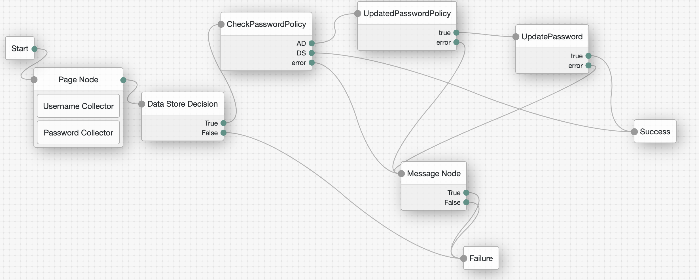
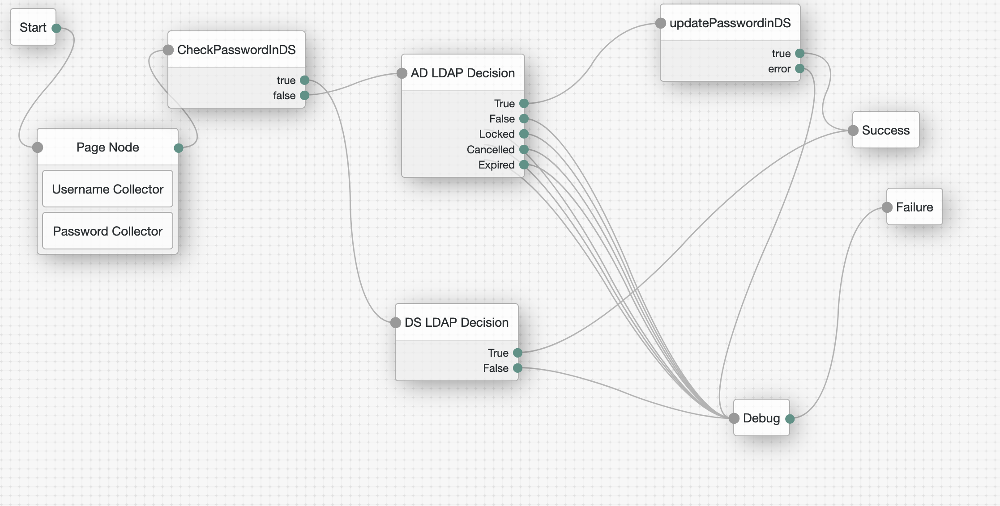

# JIT AD PASSWORD MIGRATION (AM-only)

## Introduction

This repo includes 2 possible options when we need to migrate the AD password to DS on-the-fly during AM authentication.
This assumes that the rest of the attributes are already available in the DS (from AD) using IDM-like software. Also, the AD and DS password policies should match, so the password can be migrated.


## Contents

Two possible solutions to JIT migrate the AD password into DS.

**Option1**: DS does the LDAP passthrough Policy, so we need migrate password + Policy



**Option2**: DS as User Store, AD in LDAP node so we migrate the password via script as Option1




## Configuration

**Option1**:
Create 3 AM scripted decision nodes using the node in the [src](src/Option1) directory:

- checkPasswordPolicyInDS.js
- updatePasswordPolicyInDS.js
- updatePassword.js


You will also need to configure DS with an LDAP Passthrough Authentication Policy and assign it to all users. For example:
```
dn: cn=AD Passthrough Authentication,cn=Password Policies,cn=config
objectClass: top
objectClass: ds-cfg-authentication-policy
objectClass: ds-cfg-ldap-pass-through-authentication-policy
cn: AD Passthrough Authentication
ds-cfg-java-class: org.opends.server.extensions.LDAPPassThroughAuthenticationPolicyFactory
ds-cfg-mapped-search-base-dn: OU=Users,OU=LittleCo,DC=example,DC=com
ds-cfg-mapped-search-bind-dn: CN=forgerock_support,CN=Users,DC=example,DC=com
ds-cfg-mapped-search-bind-password: ug.Is?^>8X9A=W&
ds-cfg-primary-remote-ldap-server: anastasios-kampas-windows-cpcufdj:389
ds-cfg-use-password-caching: false
createTimestamp: 20230223144807Z
creatorsName: cn=Directory Manager
entryUUID: b117e6aa-0245-417f-8c72-4e11c10a7551
ds-cfg-mapped-attribute: cn
modifiersName: cn=Directory Manager
ds-cfg-mapping-policy: mapped-search
modifyTimestamp: 20230223151258Z
```

**Option2**:
Create 2 AM scripted decision nodes using the node in the [src](src/Option2) directory:

- checkPasswordAttributeInDS.js
- updatePassword.js

The checkPasswordAttributeInDS checks first if the password exists in DS. 
If it does, then DS LDAP authentication proceeds as expected.
If it doesn't, then the AD LDAP Decision Node is used first, and then save the password in DS. In this case, in the next authentcation attempt, the DS will be used as password has been successfully migrated.


## Testing 

**Option1**:
In the first authentication of the user, AD authentication takes place which is followed by updating the Password policy and then the userPassword in DS.

```
s.A.233dee8b-bbec-48f9-a200-ebcac9c4ac13: 2023-02-24 13:01:33,557: Thread[ScriptEvaluator-0]: TransactionId[7c2db561-d230-4877-ab1c-017cc59aeaa4-19796]
ERROR: ***checkPasswordPolicyInDS node executing
s.A.233dee8b-bbec-48f9-a200-ebcac9c4ac13: 2023-02-24 13:01:33,559: Thread[ScriptEvaluator-0]: TransactionId[7c2db561-d230-4877-ab1c-017cc59aeaa4-19796]
ERROR: ***checkPasswordPolicyInDS PasswordPolicy's  value: cn=AD Passthrough Authentication,cn=Password Policies,cn=config
s.A.233dee8b-bbec-48f9-a200-ebcac9c4ac13: 2023-02-24 13:01:33,559: Thread[ScriptEvaluator-0]: TransactionId[7c2db561-d230-4877-ab1c-017cc59aeaa4-19796]
ERROR: ***checkPasswordPolicyInDS User uses AD LDAP Passthrough Auth Policy. Outcome is AD
s.A.eefdc373-b626-499f-a140-4658b9d2a177: 2023-02-24 13:01:33,563: Thread[ScriptEvaluator-1]: TransactionId[7c2db561-d230-4877-ab1c-017cc59aeaa4-19796]
ERROR: ***updatePasswordPolicyInDS node executing
s.A.eb354ff1-f2e4-485c-aff8-322426a54ce3: 2023-02-24 13:01:33,572: Thread[ScriptEvaluator-2]: TransactionId[7c2db561-d230-4877-ab1c-017cc59aeaa4-19796]
ERROR: ***UpdatePassword node executing
```

The DS logs show the BIND which uses the AD Passthrough authentication:
```
{"eventName":"DJ-LDAP","client":{"ip":"10.154.0.48","port":38584},"server":{"ip":"10.154.0.126","port":1389},"request":{"protocol":"LDAP","operation":"BIND","connId":105,"msgId":5086,"version":"3","dn":"uid=Tasos Kampas,ou=people,ou=identities","authType":"SIMPLE"},"transactionId":"7c2db561-d230-4877-ab1c-017cc59aeaa4-19796/1","response":{"status":"SUCCESSFUL","statusCode":"0","elapsedTime":9,"elapsedTimeUnits":"MILLISECONDS"},"userId":"uid=Tasos Kampas,ou=people,ou=identities","timestamp":"2023-02-24T13:01:33.551Z","_id":"cb29aefc-5170-4add-85d6-9b67766e4c27-61557"}
```

**Option2**:
In the first authentication, we check if the password exists and then use the LDAP decision node based on the outcome. Finally, we update the userPassword in DS as part of the migration.

```
s.A.263dedbb-78e3-4b63-bc39-7077dad98a91: 2023-02-24 12:48:51,734: Thread[ScriptEvaluator-7]: TransactionId[7c2db561-d230-4877-ab1c-017cc59aeaa4-18488]
ERROR: ***checkPasswordAttribute node executing
s.A.263dedbb-78e3-4b63-bc39-7077dad98a91: 2023-02-24 12:48:51,739: Thread[ScriptEvaluator-7]: TransactionId[7c2db561-d230-4877-ab1c-017cc59aeaa4-18488]
ERROR: ***checkPasswordAttribute User has Password in AD only. Use AD for auth and then migrate the password. Outcome is false
s.A.eb354ff1-f2e4-485c-aff8-322426a54ce3: 2023-02-24 12:48:51,949: Thread[ScriptEvaluator-8]: TransactionId[7c2db561-d230-4877-ab1c-017cc59aeaa4-18488]
ERROR: ***UpdatePassword node executing
```
DS access logs (password update):
```
{"eventName":"DJ-LDAP","client":{"ip":"10.154.0.48","port":38496},"server":{"ip":"10.154.0.126","port":1389},"request":{"protocol":"LDAP","operation":"MODIFY","connId":99,"msgId":5117,"dn":"uid=Tasos Kampas,ou=people,ou=identities"},"transactionId":"7c2db561-d230-4877-ab1c-017cc59aeaa4-18530/4","response":{"status":"SUCCESSFUL","statusCode":"0","elapsedTime":2,"elapsedTimeUnits":"MILLISECONDS"},"timestamp":"2023-02-24T12:49:43.365Z","_id":"cb29aefc-5170-4add-85d6-9b67766e4c27-60551"}
```